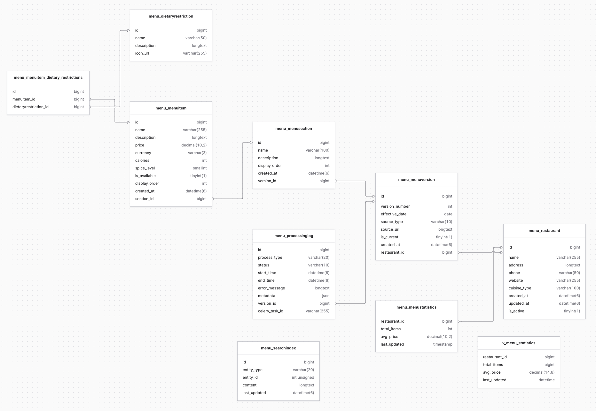
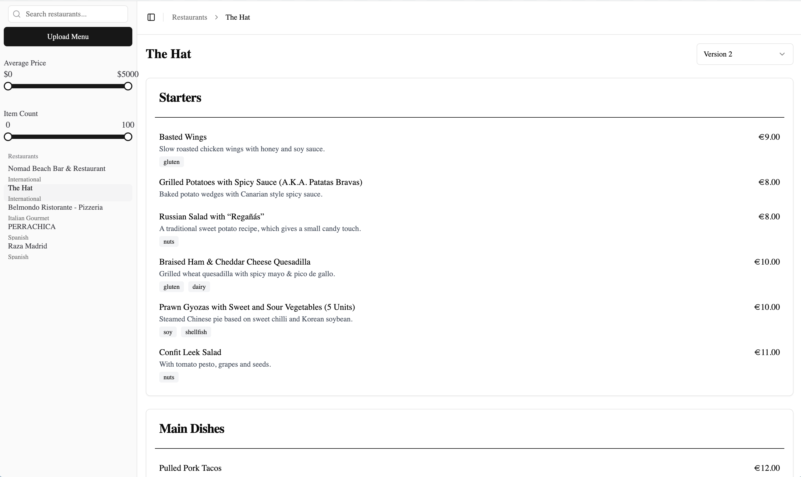

# Restaurant Menu Management System
To run the project, follow the instructions in the [backend README](backend/README.md) and [frontend README](frontend/README.md).
## Database Architecture


### Core Schema
- `menu_restaurant`: Stores restaurant details including name, address, and cuisine type
- `menu_menuversion`: Handles menu versioning with a flag `is_current` to track active versions
- `menu_menusection`: Represents menu sections (e.g., appetizers, mains)
- `menu_menuitem`: Contains individual menu items with names, descriptions, and prices

### Performance Optimizations

#### Indexes
1. **Full-Text Search Indexes** (see `fts.sql`)
   - `menu_item_search` on `menu_menuitem (name, description)`
   - `restaurant_search` on `menu_restaurant (name, address, cuisine_type)`
   - Enables efficient natural language searches across menu items and restaurants
   - Optimizes queries for partial text matches and relevance ranking

#### Materialized Views & Triggers (see `mv.sql`)
1. **Menu Statistics View (`v_menu_statistics`)**
   - Tracks per-restaurant statistics:
     - Total menu items
     - Average price
     - Last update timestamp
   - Materialized in `menu_menustatistics` table for performance
   
2. **Auto-Update Triggers** (see `mv.sql`)
   - `update_menu_statistics_insert`: Updates stats on new menu items
   - `update_menu_statistics_update`: Refreshes stats on item modifications
   - `update_menu_statistics_delete`: Adjusts stats when items are removed
   - `delete_restaurant_stats`: Cleans up stats when restaurants are deleted
   - Ensures real-time statistics without query overhead

### Menu Version Management
- Each restaurant can have multiple menu versions
- Only one version can be current (`is_current = TRUE`)
- Enables:
  - Menu history tracking
  - Scheduled menu updates
  - A/B testing of menus
  - Seasonal menu rotations

### Performance Benefits
1. **Full-Text Search**
   - Efficient text-based searches without LIKE '%term%' scans
   - Better relevance ranking in search results
   - Supports natural language queries

2. **Statistics Materialization**
   - Constant-time access to menu statistics
   - No need for expensive aggregation queries
   - Real-time updates via triggers
   - Reduced database load for common statistics queries 


### Index Usage Patterns

#### Restaurant
- **name**: Speeds up restaurant name lookups
- **cuisine_type**: Optimizes filtering/sorting by cuisine type

#### MenuVersion
- **restaurant + version_number (unique together)**: Ensures version number uniqueness per restaurant and speeds up version lookups
- **effective_date**: Optimizes date-based queries and filtering

#### MenuSection
- **version + display_order**: Optimizes ordered retrieval of sections within a specific menu version

#### MenuItem
- **section + display_order**: Speeds up ordered retrieval of items within a section
- **name**: Optimizes item name lookups
- **price**: Supports efficient price-based filtering and sorting

#### ProcessingLog
- **version + status**: Optimizes status queries for specific menu versions
- **start_time**: Supports time-based filtering and sorting of processing logs

### Index Usage Patterns
- **Ordering Indexes (display_order combinations)**: Used for maintaining menu item/section order. Critical for displaying menus in correct sequence.
- **Lookup Indexes (name fields)**: Speeds up direct lookups. Important for search functionality.
- **Filtering Indexes (price, effective_date, start_time)**: Optimizes range queries and filtering. Useful for analytics and date-based operations.
- **Relationship Indexes (automatically created for foreign keys)**: Django automatically creates indexes for ForeignKey fields. Optimizes joins and relationship queries.

> **Note**: Composite indexes (like version + display_order) can also be used for queries on their prefix (just version), but not vice versa.

## ETL Pipeline (See backend/menu/management/commands/process.py)
### Extraction
- We used the [Zerox](https://github.com/getomni-ai/zerox) python library to extract the text from the pdf files in markdown format.

### Transformation
- We used the OpenAI API to transform the markdown into a JSON format that obeys our schema structure (enforced with OpenAI Structured Outputs).

### Loading
- We used the Django ORM to load the data into the database from the JSON format. 

## Implementation Challenges
- **Materialized Views**: Materialized views are not supported in MySQL so we had to create a trigger to update the statistics view whenever a menu item was created, updated, or deleted.
- **Triggers**: Triggers are not supported in MySQL so we had to create a stored procedure to update the statistics view whenever a menu item was created, updated, or deleted.
- **Versioning**: For the versioning to work, the AI had to extract the exact same name from the menu which was unreliable at first but worked in most cases after multiple attempts.

## Future Improvements 
**Better Filtering**: In the future, we would implement more detailed filtering (e.g. by cuisine, dietary restrictions, etc.)
**More Crud Operations**: We would implement more CRUD operations to make the menu management system more robust. For example, editing a menu, deleting a menu, etc.


## Sample Queries
- We had one command that would process a menu and create/update the database records. It would get the menu from a pdf file path and then extract the data and create/update the records.
```bash
python manage.py process /path/to/menu.pdf
```
- Output:


This would show logs in the process and show if the process was successful or not.


## Examples of Inputs and Outputs
- Input: backend/pdfs/thehatmenu_eng.pdf
- Output:
